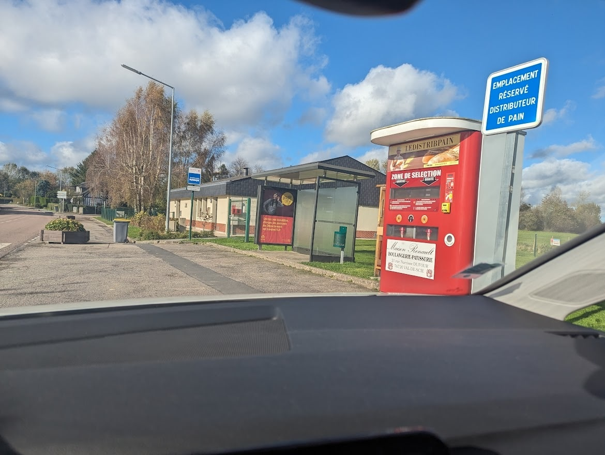

# CTF OSINT - Pain de campagne

## Présentation du CTF 
**ID** 39 dans **les CTFs de Cyrhades**

# Format du Flag
Latitude au format : xx.xxx
Longitude au format : y.yyy
séparé par une virgule, comme ceci : xx.xxx,y.yyy

## Aperçu

-----------

## Installation manuel
Vous n'utilisez pas l'application **les CTFs de Cyrhades** ? C'est dommage !
Mais voici comment installer ce CTF manuellement :

> git clone https://github.com/Hack-Oeil/OSINT_A_LA_CAMPAGNE.git

> cd OSINT_A_LA_CAMPAGNE
